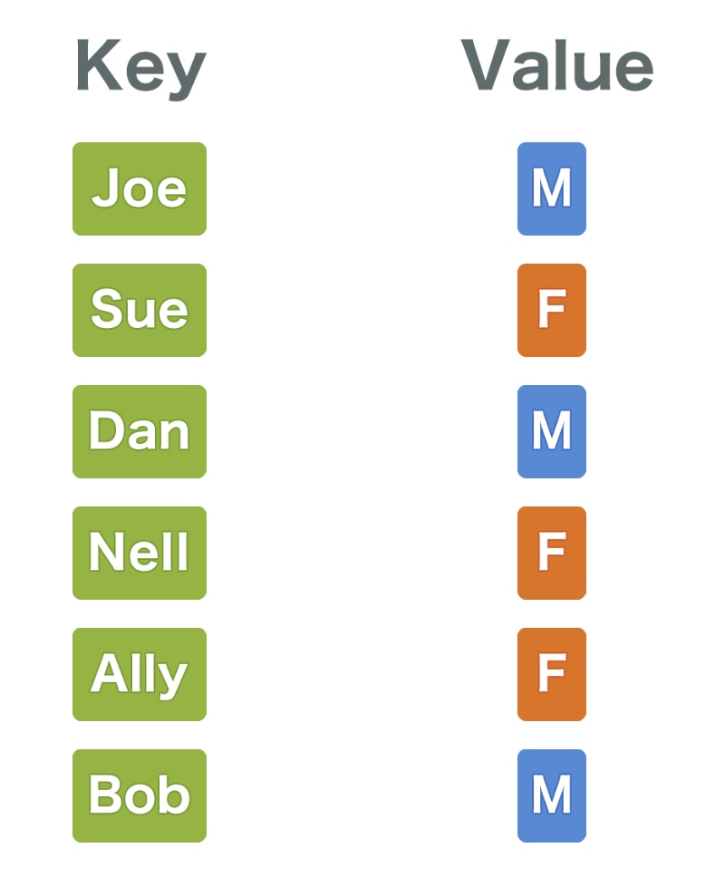

# Q. 해시 테이블

 

### 해시 테이블

 

👉   해시 테이블은 위처럼 key와 value 한쌍으로 구성된 데이터를 저장한다.
 
 

👉  만약 Ally의 성별을 알고싶다면, 배열의 처음부터 순서대로 key가 Ally인 인덱스를 찾게 된다.
 
 

이를 선형 탐색이라 하고 이는 데이터량에 비례하여 계산 시간이 늘어나게 된다.
따라서 탐색에는 적합하지 않다고 볼 수 있다.
 
 

👉  이러한 문제를 해결해주는 것이 해시 테이블이다.
 
 

👉  해시 테이블을 어떻게 채워가는지 알아보자.
 
 

1. 해시 함수를 이용하여 key의 해시값을 계산한다.
2. 배열의 상자 수인 5로 나누어 나머지를 구한다.(이를 mod 연산이라고 한다.)
3. 결과값에 해당하는 인덱스에 데이터를 넣는다.
4. 이를 반복한다.

     

👉  위처럼 연산 후 Nell의 데이터를 1번 인덱스에 넣으려고 하는데, 이미 1번 인덱스에는 값이 있다. 이럴 땐, 어떻게 해야할까??
 

바로 리스트 구조로 기존 데이터와 연결을 하면 된다. 이를 연쇄법이라고 한다.
 
 
👉  해시 테이블을 채워나가는 방법은 알게되었다. 그렇다면 데이터를 찾을 땐 어떻게 해야할지 알아보자.
 
 

👉  Dan의 성별을 구하려고 한다. 과정을 보자.
 
 

1. 해시 함수를 통해 해시값을 구한다.
2. 해시값에 mod 연산을 하여 인덱스를 구한다.
3. 배열(해시 테이블)의 인덱스에 접근하여 데이터를 가져온다.

 
 

👉  응용하여 더 생각해보자. 만약 Ally의 성별을 찾으려고 한다면,
 
 

1. 위의 방법처럼 인덱스에 접근한다.
2. 리스트를 타고 자료를 찾는 선형 탐색을 하면 원하는 데이터를 얻을 수 있다.

👉  해시 테이블을 사용할 때는 다음과 같은 사항을 고려해야 한다.
 
 

1. 해시 테이블에 사용하는 배열의 크기가 너무 작으면 충돌이 많아지고, 이때문에 선형 탐색의 빈도가 높아지게 된다.
    

2. 해시 테이블에 사용하는 배열의 크기가 너무 크면 메모리를 낭비하게 된다.
