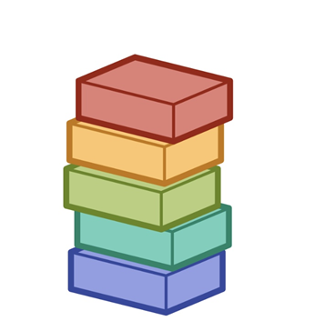

# Q. 스택

---

### 스택  
<br/>
<br/>


  
<br/>
<br/>
  
👉 스택은 물건을 세로로 쌓는다고 생각하면 된다.
쌓여있는 물건들 중 하나를 꺼내려면 위에서부터 차례로 꺼내야한다.
  
<br/>
<br/>
  


  
<br/>
<br/>
  

👉 스택에서 데이터를 추가할 때는 가장 위에 추가가 된다. 이를 push하고 한다.  
  
<br/>
<br/>
  


  
<br/>
<br/>
  

👉 스택에서 데이터를 꺼낼 때도 가장 위, 즉 가장 최근에 추가한 데이터가 꺼내진다. 이를 pop이라고 한다.  
<br/>


👉 이러한 구조를 ‘Last In First Out’이라 하며 ‘LIFO’라고도 한다.
  
<br/>
  

👉 이제 이를 바탕으로 코드로 알아보자!
  
<br/>
  

```jsx
const Stack = (function () {   ... 1
    function Stack() {
        this.top = null;
        this.count = 0;
    };

    function Node(data) {
        this.data = data;
        this.next = null;
    }

    return Stack;
})();

const stack = new Stack();   ... 2
console.log(stack);

==========================

Stack{ top: null, count: 0 }
```
<br/>

👉 어떻게 Stack 인스턴스가 생성되었는지 알아보자.  
<br/>


1. 즉시실행 함수가 실행이 되고, return 값인 Stack 함수를 const Stack에 넣어준다.

2. 결국 Stack을 호출하면 즉시실행 함수의 Stack 함수가 실행이 된다.

하지만 우린 인스턴스를 사용해야 한다. 따라서 new 키워드 사용하여 인스턴스를 생성한다.

원리는 다음과 같다. new 키워드를 사용하면 빈 객체 this를 만든다. 위에서는 이 this에 top = null, count = 0을 넣어준다. Stack에는 return이 없기 때문에 방금 만든 새 객체를 return 하도록 처리해준다.

따라서 stack에는 Stack 인스턴스가 할당되게 된다.
  
<br/>
  

👉 자 이제 stack은 만들었고, 이제 push와 pop을 구현하러 가보자.
  
<br/>
  

```jsx
Stack.prototype.push = function (data) {
        const node = new Node(data);
        node.next = this.top;   ... 1
		    this.top = node;   ... 2
				this.count++;

				return this.count;
    }
.
.
.

const stack = new Stack();
stack.push(1);
stack.push(2);
console.log(stack);

==========================

Stack {
  top: Node { data: 2, next: Node { data: 1, next: null } },
  count: 2
}
```
  
  
👉 스택의 맨 위에 데이터를 넣는 push 메서드이다.
  
  

1. 새로 만들어진 node의 다음 node 위치를 현재의 node로 연결해준다. 그 결과 배열과 같은 형태라면 맨 앞, 스택이면 맨 위에 node가 들어가게 된다.

2. 현 위치를 나타내는 this.top이 node를 가리키게 한다.
  
<br/>
  

```jsx
Stack.prototype.pop = function () {
	      let data;
        if (!this.top) {   ... 1
            return console.log('stack이 비었습니다.');
        }
        data = this.top.data; ... 2
        this.top = this.top.next;   ... 3
        this.count--;
        return data;

    }
.
.
.

const stack = new Stack();
stack.push(1);
stack.push(2);
console.log(stack.pop());
console.log(stack.pop());
console.log(stack.pop());
console.log(stack);

=======================

2
1
stack이 비었습니다.
undefined
Stack { top: null, count: 0 }
```
  
  
👉 stack의 최상위인 this.top이 가리키는 데이터를 반환해주는 pop 메서드이다.
  
  
1. this.top이 null을 가리키게 되면 오류가 발생하게 된다. 따라서 이를 방지하기 위해 this.top이 비었다면 함수를 끝낸다.

2. this.top이 가리키는 최상위 노드의 데이터 값을 넣어준다. 추후 이를 반환한다.

3. this.top.next는 새로운 node가 들어오기 전의 최상위 노드를 가리키고 있다. 이를 this.top에 넣어주면 this.top이 이전의 값을 가리키기 때문에 stack이 값이 나간 후 최신화 된 것 처럼 표현할 수 있다.
  
<br/>
  

```jsx
Stack.prototype.stackTop = function () {
  return this.top.data;
};

Stack.prototype.getCount = function () {
  return this.count;
};
```

👉 그 외에도 위처럼 여러 메서드를 추가로 만들 수 있다.
